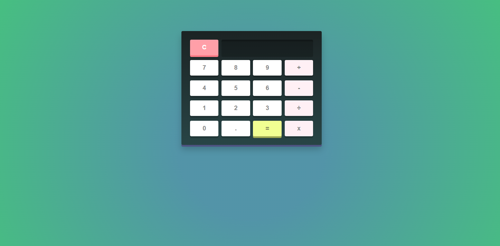

# calculator
This is a basic calculator web application built using HTML, CSS, and JavaScript. It can perform standard arithmetic operations such as addition, subtraction, multiplication, and division. The project is designed to help beginners understand how to create interactive user interfaces with simple front-end technologies.

## 🔗 Live Demo
[Click here to view the project](https://ankitrathore8749.github.io/calculator/)

## 📸 Screenshot
